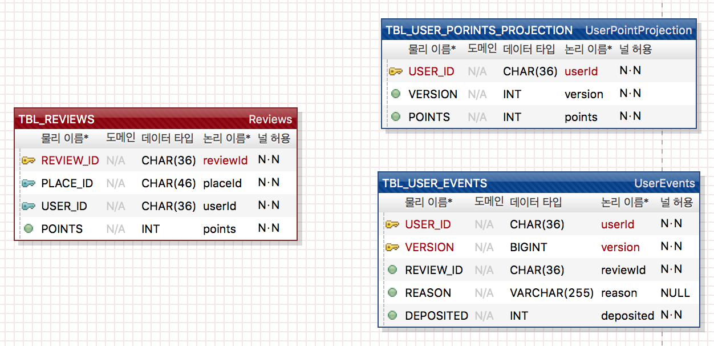

- [ERD](#erd)
- [DDL](#ddl)
- [포인트 적립](#포인트-적립)
- [포인트 조회](#포인트-조회)

----------

## ERD


</br></br>

## DDL

```
-- Reviews
CREATE TABLE `TBL_REVIEWS` (
	`REVIEW_ID` CHAR(36) NOT NULL, -- reviewId
	`PLACE_ID`  CHAR(46) NOT NULL, -- placeId
	`USER_ID`   CHAR(36) NOT NULL, -- userId
	`POINTS`    INT      NOT NULL  -- points
);

-- Reviews
ALTER TABLE `TBL_REVIEWS`
	ADD CONSTRAINT `PK_TBL_REVIEWS` -- Reviews 기본키
		PRIMARY KEY (
			`REVIEW_ID` -- reviewId
		);

-- Reviews 유니크 인덱스
CREATE UNIQUE INDEX `UIX_TBL_REVIEWS`
	ON `TBL_REVIEWS` ( -- Reviews
		`PLACE_ID` ASC, -- placeId
		`USER_ID` ASC   -- userId
	);

------------------------------------------------------------

-- UserEvents
CREATE TABLE `TBL_USER_EVENTS` (
	`USER_ID`   CHAR(36)     NOT NULL, -- userId
	`VERSION`   BIGINT       NOT NULL, -- version
	`REVIEW_ID` CHAR(36)     NOT NULL, -- reviewId
	`REASON`    VARCHAR(255) NULL,     -- reason
	`DEPOSITED` INT          NOT NULL  -- deposited
);

-- UserEvents
ALTER TABLE `TBL_USER_EVENTS`
	ADD CONSTRAINT `PK_TBL_USER_EVENTS` -- UserEvents 기본키
		PRIMARY KEY (
			`USER_ID`, -- userId
			`VERSION`  -- version
		);

--------------------------------------------------------------

-- UserPointProjection
CREATE TABLE `TBL_USER_PORINTS_PROJECTION` (
	`USER_ID` CHAR(36) NOT NULL, -- userId
	`VERSION` INT      NOT NULL, -- version
	`POINTS`  INT      NOT NULL DEFAULT 0 -- points
);

-- UserPointProjection
ALTER TABLE `TBL_USER_PORINTS_PROJECTION`
	ADD CONSTRAINT `PK_TBL_USER_PORINTS_PROJECTION` -- UserPointProjection 기본키
		PRIMARY KEY (
			`USER_ID` -- userId
		);


```

</br>

## 포인트 적립

```
///////////////////// Review Domain ////////////////////////
reviewEvent(event) {
    checkConstraints(event);

    points;
    switch(event.action) {
        case ADD:
            newPoints = calculateReviewPoints(event);

            points = newPoints;
            break;
        case MOD:
            beforePoints = reviewsRepository.findByReviewId(event.reviewId).points; 
            newPoints = calculateReviewPoints(event);

            points = newPoints - beforePoints;
            break;
        case DELETE:
            beforePoints = reviewsRepository.findByReviewId(event.reviewId).points;
            reviewsRepository.deleteByReviewId(event.reviewId);

            points = -beforePoints;
            break;
    }

    publish(new UserPointsDeposited(event, points));
}

checkConstraints(event) {
    // SELECT * FROM TBL_REVIEWS WHERE PLACE_ID = 'event.placeId' AND USER_ID = 'event.userId';
    if(null != reviewsRepository.findByPlaceIdAndUserId(event.placeId, event.userId))
        IncompatibleAction("한 유저는 한 장소에 리뷰를 하나만 작성 가능");
}

calculateReviewPoints(event) {
    points = 0;

    if(null != event.content && 0 < event.content.length())
        points += 1;
    if(null != event.attachedPhotoIds && 0 < event.attachedPhotoIds.length())
        points += 1;

    // SELECT * FROM TBL_REVIEWS WHERE PLACE_ID = 'event.placeId' AND USER_ID <> 'event.userId';
    if(null == reviewsRepository.findByPlaceIdAndNotUserId(event.placeId, event.userId))
        points += 1;

    return points;
}

////////////////////////// User Point Events Domain /////////////////////////
earnPoints(event:userPointsDeposited) {
    // SELECT * FROM TBL_USER_EVENTS WHERE USER_ID = 'event.userId' ORDER BY VERSION DESC LIMIT 1;
    latestUserEvent = userEventsRepository.findByUserIdAndLatestVersion(event.userId)
    userEventsRepository.save(new UserPointsDeposited(event.userId, latestUserEvent.version + 1, event.reviewId, event.reason, event.deposited));

    publish(new UserPointsChanged(event.userId, latestUserEvent.version + 1, event.deposited))
}

//////////////////////////// User Projection Domain ///////////////////////////
projectionUserPoints(event:userPointsChaged) {
    userPointsProjection = userPointsProjectionRepository.findByUserId(event.userId);
    if(null == userPoints) {
        userPointsProjection = new UserPointsProjection(event.userId, event.version, event.deposited);
    } else {
        userPointsProjection.points += event.deposited
    }
        userPointsProjectionRepository.save(userPointsProjection);
}
```

</br>

## 포인트 조회

```
getPointsByUserId (userId) {
    userPointsProjectionRepository;

    return userPointsProjectionRepository.findByUserId(userId).points;
}
```